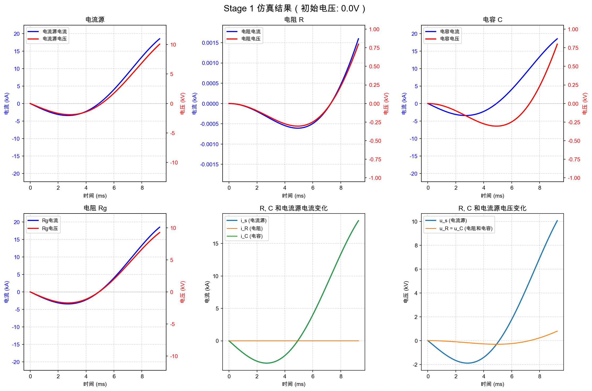
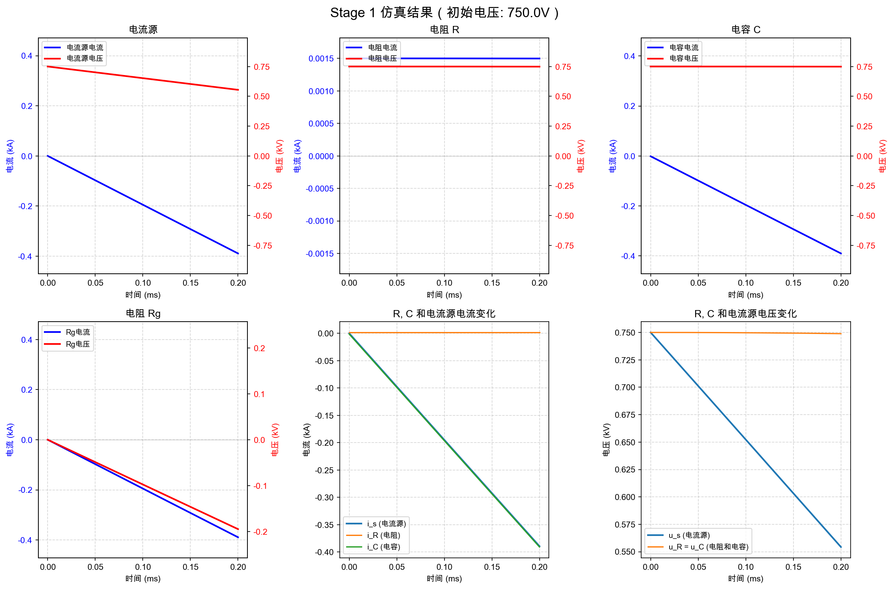
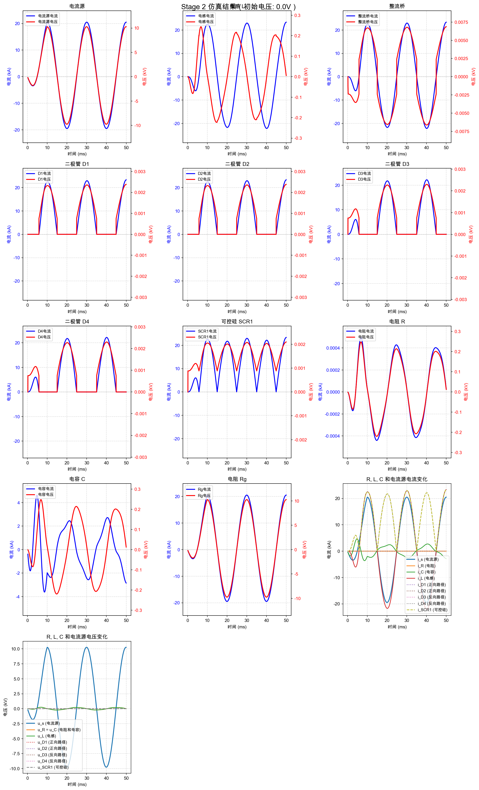
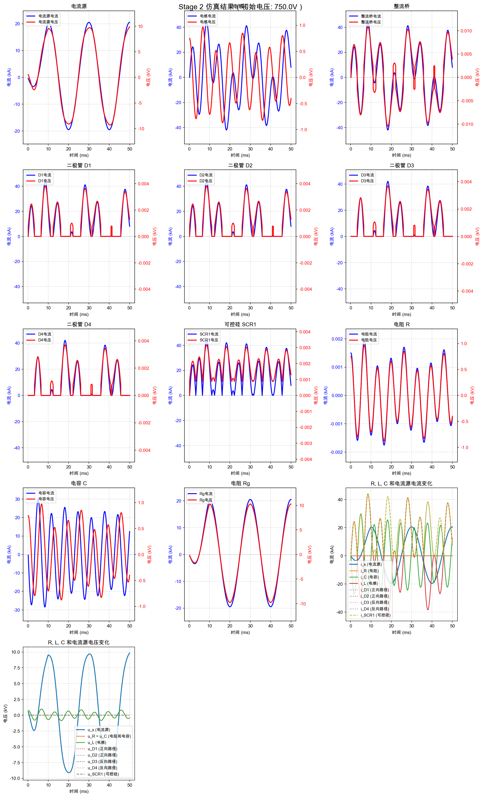
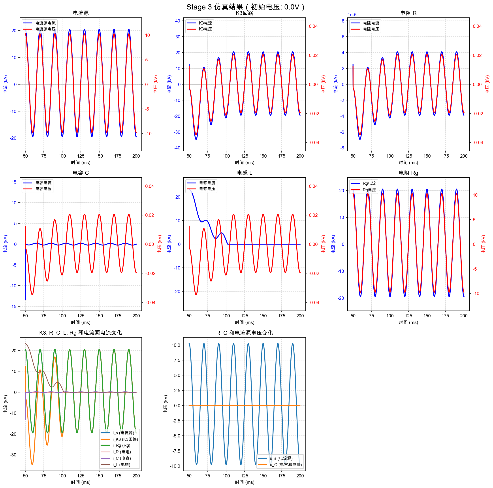
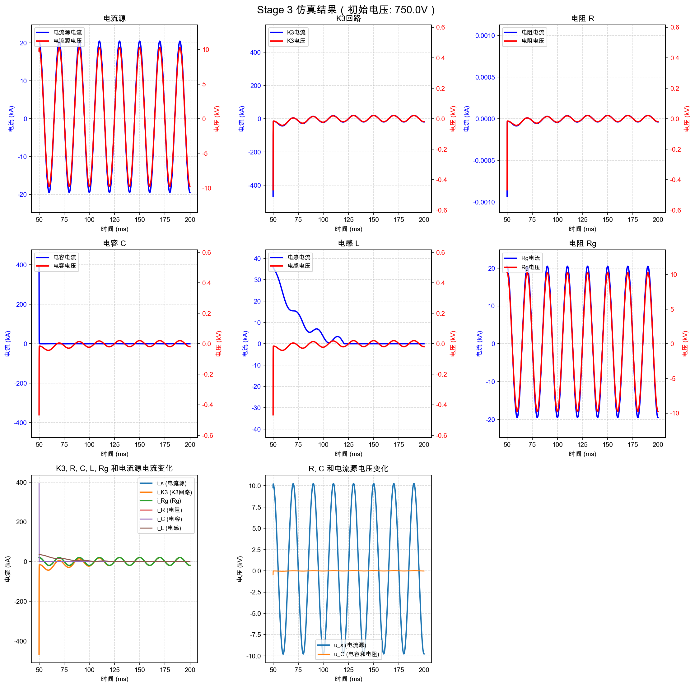

# 电路仿真项目：中性点接地电流分析

## 项目简介

本项目用于仿真和分析中性点通过大电流时的电路响应。当系统发生单相短路接地故障时，中性点会通过峰值为20kA（含500A直流分量）的短路电流，持续时间200ms。电路拓扑在0-200ms内发生了一系列变化，本项目通过数值仿真方法分析各阶段的电流和电压变化。

## 电路参数

- **电容 C**: 36 mF (0.036 F)
- **电阻 R**: 500 Ω
- **接地电阻 Rg**: 0.5 Ω
- **电感 L**: 30 µH (0.00003 H)
- **初始电压**: 0V 或 750V（两种情况）

## 电流源特性

中性点电流表达式：

```
i_s(t) = {
    (t/0.01) * [20000*sin(100πt - π/2) + 500],  0 ≤ t < 0.01s
    20000*sin(100πt - π/2) + 500,                t ≥ 0.01s
}
```

- **峰值电流**: 20 kA
- **直流分量**: 500 A
- **频率**: 50 Hz
- **上升时间**: 10 ms（线性上升）

## 仿真阶段

### Stage 1: 0-200微秒

#### 电路拓扑

在0-200微秒阶段，SCR和K3所在回路尚未导通，短路电流通过R//C回路，再串Rg后通流。

**拓扑结构**: 电流源 → R∥C → Rg → 地

#### 建模方法

**状态变量**: 
- `u_C`: 电容电压（也是R两端电压）

**状态方程推导**:

根据基尔霍夫电流定律（KCL）：
```
i_s(t) = i_R + i_C
```

其中：
- `i_R = u_C / R`（电阻电流）
- `i_C = C · du_C/dt`（电容电流）

整理得到状态方程：
```
du_C/dt = (i_s(t) - u_C / R) / C
```

**各支路电流和电压计算**:
- `i_R = u_C / R`
- `i_C = i_s - i_R`（由KCL）
- `i_Rg = i_s`（由KCL）
- `u_C`: 由ODE求解得到
- `u_Rg = i_Rg · Rg = i_s · Rg`
- `u_s = u_C + u_Rg`（由KVL）

#### 数值求解

- **求解器**: `scipy.integrate.solve_ivp`
- **方法**: Radau（适用于刚性问题）
- **时间范围**: 0 到 200 微秒 (0 到 0.0002 秒)
- **采样间隔**: 1 微秒 (0.000001 秒)
- **相对容差**: 1e-8
- **绝对容差**: 1e-10

#### 仿真结果

**情况1：初始电压为0V**



**情况2：初始电压为750V**



---

### Stage 2: 200微秒-50毫秒

#### 电路拓扑

在200微秒时，电子旁路（整流桥）导通，电路拓扑发生变化。

**拓扑结构**: 电流源 → [L-整流桥 | R | C] → Rg → 地

#### 整流桥电路

整流桥包含4个二极管（D1, D2, D3, D4）和1个可控硅（SCR1），实现全波整流：

- **当 i_L > 0 时**: 电流路径为 L → D1 → SCR1 → D2
- **当 i_L < 0 时**: 电流路径为 L → D3（反接）→ SCR1（反接）→ D4（反接）

#### 非线性器件伏安特性

**二极管（D1, D2, D3, D4）**（导通时）:
```
U(D) = 0.75 + 0.00007 × i(t)
```

**可控硅SCR1**（导通时）:
```
U(SCR1) = 0.88 + 0.000052 × i(t)
```

**整流桥总伏安特性**:
- 正向路径（i_L > 0）: `u_bypass = 2.38 + 0.000192 × i_L`
- 反向路径（i_L < 0）: `u_bypass = -2.38 + 0.000192 × i_L`
- 统一表达式: `u_bypass = sign(i_L) × 2.38 + 0.000192 × i_L`

#### 建模方法

**状态变量**:
- `u_C`: 电容电压（也是R两端电压，以及L-整流桥支路总电压）
- `i_L`: 电感电流（也是L-整流桥支路电流）

**状态方程推导**:

**KCL方程**（在电流源节点）:
```
i_s(t) = i_L + i_R + i_C
```

其中：
- `i_L`: 电感电流（L-整流桥支路电流）
- `i_R = u_C / R`: 电阻电流
- `i_C = C · du_C/dt`: 电容电流

**KVL方程**（L-整流桥支路）:
```
u_C = u_L + u_bypass
```

其中：
- `u_L = L · di_L/dt`: 电感两端电压
- `u_bypass`: 整流桥两端电压（根据电流方向计算）

整理得到状态方程：
```
du_C/dt = (i_s(t) - i_L - u_C/R) / C
di_L/dt = (u_C - u_bypass) / L
```

**各支路电流和电压计算**:
- `i_L`: 由ODE求解得到
- `i_R = u_C / R`
- `i_C = i_s - i_L - i_R`（由KCL）
- `i_Rg = i_s`（由KCL）
- `u_C`: 由ODE求解得到
- `u_bypass`: 根据`i_L`的方向计算
- `u_L = u_C - u_bypass`
- `u_Rg = i_Rg · Rg`
- `u_s = u_C + u_Rg`

**单个器件电流和电压**:
- 当`i_L > 0`时：`i_d1 = i_d2 = i_scr1 = i_L`，`i_d3 = i_d4 = 0`
- 当`i_L < 0`时：`i_d3 = i_d4 = i_scr1 = |i_L|`，`i_d1 = i_d2 = 0`
- 各器件的电压根据其伏安特性和导通状态计算

#### 数值求解

- **求解器**: `scipy.integrate.solve_ivp`
- **方法**: Radau
- **时间范围**: 200 微秒到 50 毫秒 (0.0002 到 0.05 秒)
- **采样间隔**: 10 微秒 (0.00001 秒)
- **平滑处理**: 使用`tanh`函数平滑整流桥在`i_L = 0`处的电压跳变，避免数值不稳定

#### 仿真结果

**情况1：初始电压为0V**



**情况2：初始电压为750V**



---

### Stage 3: 50毫秒-200毫秒

#### 电路拓扑

在50ms时，K3闭合，L、R、C回路被短接。

**拓扑结构**: 电流源 → [K3 | (L + bypass) | R | C] → Rg → 地

**关键特性**:
- K3闭合后，四个支路（K3、L+bypass、R、C）并联
- 当`|i_L| < I_SCR_OFF_THRESHOLD`（0.1A）时，L+bypass支路断开，拓扑变为：K3 | R | C
- 由于K3电阻很小（R_K3 = 0.000001 Ω），各并联支路电压接近0
- 大部分电流由K3接管

#### 建模方法

**状态变量**:
- `u_C`: 电容电压（被K3短接，会快速衰减到接近0）
- `i_L`: 电感电流（L回路被短接，会快速衰减到0）

**状态方程推导**:

**当L回路导通**（`|i_L| ≥ I_SCR_OFF_THRESHOLD`）:

KCL方程：
```
i_s(t) = i_K3 + i_L + i_R + i_C
```

其中：
- `i_K3 = u_C / R_K3`: K3回路电流
- `i_L`: 电感电流
- `i_R = u_C / R`: 电阻电流
- `i_C = C · du_C/dt`: 电容电流

KVL方程（L+bypass支路）：
```
u_C = u_L + u_bypass
```

其中：
- `u_L = L · di_L/dt`
- `u_bypass = rectifier_bridge_voltage(i_L)`

整理得到状态方程：
```
du_C/dt = (i_s - i_L - u_C/R - u_C/R_K3) / C
di_L/dt = (u_C - u_bypass) / L
```

**当L回路断开**（`|i_L| < I_SCR_OFF_THRESHOLD`）:

KCL方程：
```
i_s(t) = i_K3 + i_R + i_C
```

`i_L`快速衰减：
```
di_L/dt = -i_L / τ_L
```

其中`τ_L = L / R_K3`为L回路的衰减时间常数。

状态方程：
```
du_C/dt = (i_s - u_C/R - u_C/R_K3) / C
di_L/dt = -i_L · R_K3 / L  （当|i_L|很小时，设为0避免数值问题）
```

**各支路电流和电压计算**:
- `i_K3 = u_C / R_K3`
- `i_R = u_C / R`
- `i_C`: 由数值微分计算或由KCL得到
- `i_L`: 由ODE求解得到
- `i_Rg = i_s`（由KCL）
- `u_C`: 由ODE求解得到
- `u_K3 = u_C`（并联）
- `u_Rg = i_Rg · Rg`
- `u_s = u_C + u_Rg`

#### 数值求解

- **求解器**: `scipy.integrate.solve_ivp`
- **方法**: Radau
- **时间范围**: 50 毫秒到 200 毫秒 (0.05 到 0.2 秒)
- **采样间隔**: 10 微秒 (0.00001 秒)
- **初始条件**: 从Stage 2的最终值继承

#### 仿真结果

**情况1：初始电压为0V**



**情况2：初始电压为750V**



---

## 项目结构

```
electricity_cal/
├── README.md                    # 本文档
├── sources/                      # 源代码目录
│   ├── source.py                # 电流源定义
│   ├── circuit_params.py         # 电路参数配置
│   ├── stage_1.py               # Stage 1仿真
│   ├── stage_2.py               # Stage 2仿真
│   ├── stage_3.py               # Stage 3仿真
│   ├── graph.py                 # 绘图工具
│   ├── serialize.py             # CSV保存工具
│   └── reader.py                # 结果读取工具
├── examples/                     # 示例结果图片
│   ├── stage1_case1_results.png
│   ├── stage1_case2_results.png
│   ├── stage2_case1_results.png
│   ├── stage2_case2_results.png
│   ├── stage3_case1_results.png
│   └── stage3_case2_results.png
├── results/                      # 仿真结果输出目录（.gitignore）
│   ├── *.csv                    # CSV结果文件
│   └── *.png                    # 图片结果文件
└── 问题描述_md_with_images/      # 问题描述文档
```

## 使用方法

### 环境配置

1. 创建Conda环境：
```bash
cd sources
bash setup.sh
conda activate electricity_cal
```

2. 环境依赖：
- Python 3.10
- numpy
- scipy
- matplotlib

### 运行仿真

**运行Stage 1仿真**:
```bash
cd sources
python stage_1.py
```

**运行Stage 2仿真**:
```bash
cd sources
python stage_2.py
```

**运行Stage 3仿真**:
```bash
cd sources
python stage_3.py
```

### 输出文件

仿真结果会保存在`results/`目录下：
- **CSV文件**: 包含所有时间点的电流和电压数据
- **PNG图片**: 包含各元件的电流和电压波形图

## 技术特点

1. **数值求解**: 使用`scipy.integrate.solve_ivp`求解常微分方程组
2. **非线性建模**: 准确建模二极管和可控硅的非线性伏安特性
3. **整流桥建模**: 实现全波整流桥的双向导通特性
4. **平滑处理**: 使用`tanh`函数平滑非线性器件的电压跳变，提高数值稳定性
5. **阶段继承**: Stage 2和Stage 3的初始条件从上一阶段的最终值继承
6. **可视化**: 自动生成各元件的电流和电压波形图

## 注意事项

1. **数值稳定性**: 
   - 使用Radau求解器处理刚性问题
   - 使用平滑函数处理非线性器件的跳变
   - 调整相对容差和绝对容差以获得合适的精度

2. **初始条件**:
   - Stage 1需要手动指定初始电压（0V或750V）
   - Stage 2和Stage 3自动从上一阶段继承初始条件

3. **采样间隔**:
   - Stage 1: 1微秒（高频响应）
   - Stage 2和Stage 3: 10微秒（平衡精度和效率）

4. **结果文件**:
   - CSV文件使用UTF-8-BOM编码，可在Excel中正确显示中文
   - 图片文件保存在`results/`目录，不会自动显示，仅保存

## 参考文献

- [scipy.integrate.solve_ivp文档](https://docs.scipy.org/doc/scipy/reference/generated/scipy.integrate.solve_ivp.html)
- [电路分析基础](https://en.wikipedia.org/wiki/Circuit_analysis)

## 作者

本项目用于分析中性点接地电流的电路响应，通过数值仿真方法求解各阶段的电流和电压变化。

