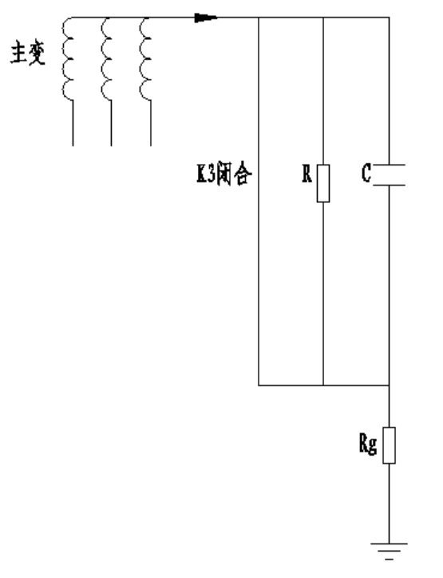
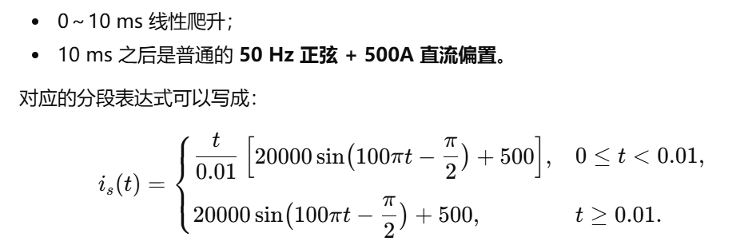

问题描述：

1.  已知：C=36mF,R=500欧姆，Rg=0.5欧姆，L=30微亨，电压初值为0V、750V两种情况。

2.  当中性点通过峰值为20kA持续200ms的单相短路接地电流时，装置内的电路拓扑在0-200ms内发生了一系列变化如下：

```{=html}
<!-- -->
```
(1) 电路拓扑变化：0-200微秒，这个阶段SCR和K3所在回路尚未导通，短路电流通过R//C回路，再串Rg后通流，拓扑如下：

{width="2.3722222222222222in"
height="2.890277777777778in"}

(2) 电路拓扑变化：200微秒-50毫秒，电子旁路导通，拓扑如下：

{width="2.0930555555555554in"
height="2.702777777777778in"}

    其中D1和D2为整流二极管，SCR1为晶闸管。D1、D2导通后的伏安特性为：U(D1)=U(D2)=0.75+0.00007\*i（t）,SCR导通后的伏安特性为：U（SCR1）=0.88+0.000052\*i（t）。

```{=html}
<!-- -->
```
1.  电路拓扑变化：50毫秒-200毫秒，L所在回路由于晶闸管的退出而退出，K3闭合，大部分电流由K3接管，计算50-200毫秒时，K3回路的电流，电阻和电容回路电流以及Uc。

```{=html}
<!-- -->
```
(3) 拓扑如下：

{width="3.0805555555555557in"
height="4.013888888888889in"}

```{=html}
<!-- -->
```
3.  计算：

```{=html}
<!-- -->
```
(1) 给出电压（不包含Rg支路）、各支路电流随时间变化的表达式，并代入已知数据以后的解析式，计算从0-200ms，每隔10微秒计算一次各回的电流和电压。

    求解过程：

```{=html}
<!-- -->
```
2.  中性点通过峰值为20kA，含500A直流，持续200ms的单相短路接地电流时，表达式如下：

{width="5.7625in"
height="1.9208333333333334in"}

    波形如下，基本符合大电流峰值试验波形
